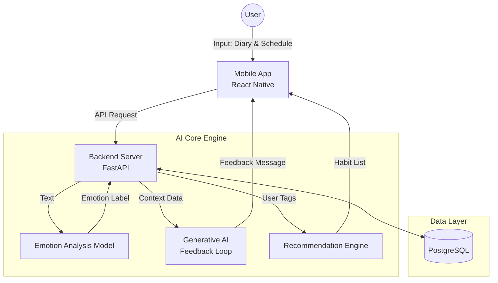

# HABITS 🧘‍♀️
> **Psychology-based Personalized Habit Coaching Service with AI**
> 심리 이론 기반의 자아 탐색과 AI 감정 분석을 통한 개인 맞춤형 습관 코칭 서비스

[]() []() []() []()

## 📖 Project Overview (프로젝트 개요)

**"무작정 따라 하는 습관이 아닌, '나'를 이해하고 성장시키는 습관 코칭"**

**HABITS**는 사용자의 심리적 성향과 현재의 감정 상태를 데이터를 기반으로 분석하여, '이상적인 나'로 나아가는 과정을 돕는 AI 기반 습관 코칭 서비스입니다. 단순한 To-do 리스트를 넘어, 사용자의 맥락(Context)을 이해하고 지속 가능한 성장을 지원합니다.

### 🎯 Key Goals
- **Self-Discovery:** 자체 성격 테스트를 통한 '현재의 나'와 '이상적인 나'의 간극 파악
- **Context-Aware:** 사용자의 라이프스타일(통근, 취침 시간 등)을 고려한 최적의 습관 시간대 추천
- **Emotional Feedback:** KoELECTRA 기반 감정 분석을 통해 공감하고 격려하는 피드백 루프 제공

---

## 🏗 System Architecture (시스템 아키텍처)

본 프로젝트는 **Microservice-oriented Architecture**를 지향하며, 각 모듈이 유기적으로 데이터를 주고받도록 설계되었습니다.



## 🛠 Tech Stack (기술 스택)

| Category | Technology | Description |
| :--- | :--- | :--- |
| **Frontend** |  | iOS/Android 크로스 플랫폼 앱 개발 |
| **Backend** |  | 비동기 처리에 최적화된 고성능 Python 서버 |
| **Database** |  | 사용자 정보 및 습관 로그 관리를 위한 RDBMS |
| **AI (NLP)** | **Hugging Face (KoELECTRA)** | 한국어 감정 분석 (Fine-tuned Model) |
| **AI (Gen)** | **OpenAI API (GPT-4o)** | 상황 인식 기반 자연어 피드백 생성 |
| **AI (Rec)** | **Recombee** | 아이템 기반 협업 필터링 및 하이브리드 추천 |
| **Infra** | **Firebase (FCM)** | 푸시 알림 및 사용자 인증 |

---

## 🧠 Core Logic Design (핵심 로직 설계)

### 1. 4-Step Habit Coaching Pipeline
사용자가 서비스를 이용하는 흐름에 따라 4단계 파이프라인이 작동합니다.

1.  **Diagnosis (진단):** 성격 테스트 결과와 이상향 태그(`#대담함`, `#도전`) 매핑
2.  **Suggestion (제안):** `Cold Start` 알고리즘을 통한 초기 습관 추천
3.  **Execution (실행):** 캘린더 뷰 기반의 이행 체크 및 타임테이블 연동
4.  **Feedback (피드백):** 이행률 65% 미만 시 난이도 조절 제안 (Adaptive Feedback)

### 2. Context-Aware Recommendation Algorithm
사용자의 스케줄(Context)에 따라 습관의 추천 가중치(Weight)를 재산정합니다.

```python
# Pseudo-code: Context Logic
def re_rank_habits(habits, context):
    if context == 'COMMUTE':
        # 통근 시간에는 '오디오' 타입 습관 우대
        return prioritize(habits, type='AUDIO')
    elif context == 'BEDTIME':
        # 취침 전에는 '정적인' 습관 우대
        return prioritize(habits, type='CALM')
```
### 3. Emotion Analysis & Feedback Loop
사용자의 일기 텍스트를 분석하여 맞춤형 피드백을 생성하는 로직입니다.
- **Input:** 일기 텍스트 ("오늘 너무 지치고 힘들었다.")
- **Model:** `monologg/koelectra-base-finetuned-emotion`
- **Output Class:** `Sadness (0.89)`
- **Action:** LLM을 호출하여 **"위로"** 및 **"습관 강도 하향"** 메시지 생성

---

## 📂 Project Structure (폴더 구조 - 예상도)

```bash
HABITS
├── backend
│   ├── app
│   │   ├── api          # API Endpoints (Routers)
│   │   ├── core         # Config & Security
│   │   ├── models       # Database Models (SQLAlchemy)
│   │   ├── schemas      # Pydantic Schemas
│   │   ├── services     # Business Logic (AI, Recommendation)
│   │   └── main.py      # Entry Point
│   ├── ml_models        # KoELECTRA Model & Tokenizer
│   └── requirements.txt
├── frontend
│   ├── src
│   │   ├── components   # Reusable UI Components
│   │   ├── screens      # Calendar, MyPage, Onboarding
│   │   ├── navigation   # Stack & Tab Navigators
│   │   ├── services     # API Call Functions
│   │   └── utils        # Helpers
│   ├── App.js
│   └── package.json
└── README.md
```

## 📅 Roadmap

- [x] **Phase 1: 기획 및 설계 (Planning & Design)**
    - [x] 요구사항 정의 및 페르소나 설정
    - [x] 시스템 아키텍처 및 DB 스키마 설계
    - [x] UI 와이어프레임 설계
- [ ] **Phase 2: MVP 개발 (Development)**
    - [ ] FastAPI 백엔드 구축 및 KoELECTRA 모델 연동
    - [ ] React Native 클라이언트 기본 UI 구현
    - [ ] Recombee 추천 엔진 연동
- [ ] **Phase 3: 고도화 (Optimization)**
    - [ ] LLM 프롬프트 엔지니어링 최적화
    - [ ] 베타 테스트 및 사용자 피드백 반영
     
## 📑 Documents (프로젝트 문서)

프로젝트 기획 과정과 팀 운영 규칙에 대한 상세 문서는 아래에서 확인하실 수 있습니다.

- **[💡 Ideation & Brainstorming](./docs/IDEATION.md)**: 초기 아이디어 스케치 및 해결하고자 하는 문제 정의
- **[📝 Project Scenario & Specs](./docs/SCENARIO.md)**: 사용자 페르소나 시나리오 및 상세 기능 명세
- **[⚖️ Team Ground Rules](./docs/GROUND_RULES.md)**: 팀 커뮤니케이션 규칙 및 협업 가이드라인
